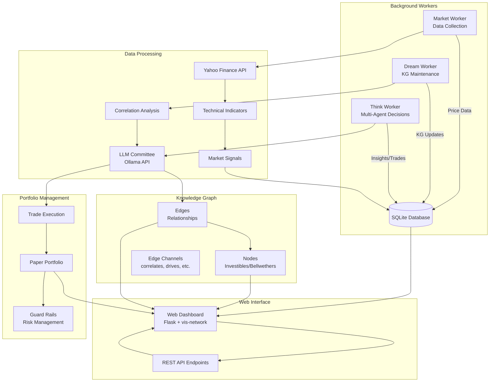
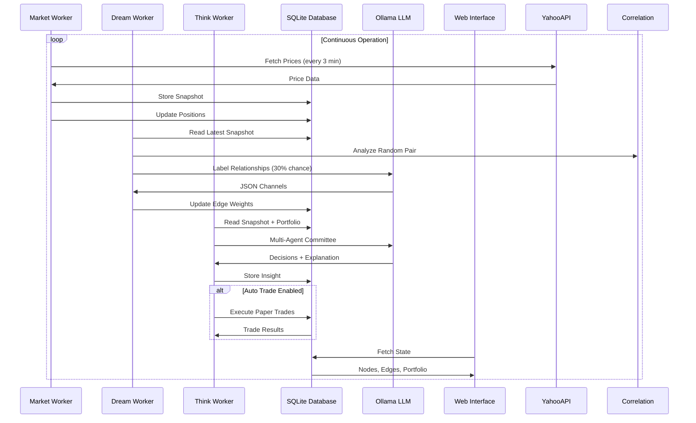
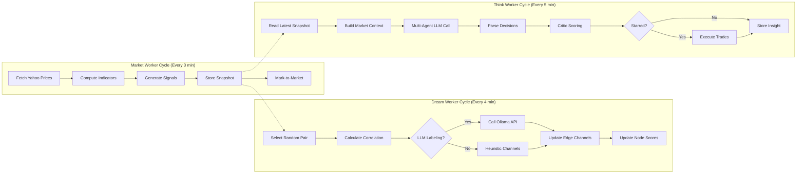

# KGDreamInvest (Paper) — Multi-Agent Allocator + Investing Knowledge Graph + GUI

> **Forked from**: [DormantOne/kgdreaminvest](https://github.com/DormantOne/kgdreaminvest)  
> This repository contains refactored and enhanced version with modular architecture.

A continuously “thinking” paper-trading sandbox:
- pulls daily market data (Yahoo Finance chart endpoint)
- maintains a small investing knowledge graph in SQLite
- runs background loops to **observe → dream (KG) → think (plans)**
- shows everything in a “pretty” web dashboard (vis-network)

> **Educational / experimental. Not financial advice. Paper trading only.**
> This project does **not** place real trades and does **not** connect to any broker.

---

## System Architecture



## Process Flow



## Three-Worker Architecture



## Screenshot


## Prerequisites

1) **Python**
   - Python 3.10+ recommended

2) **LLM Provider** (required for "thinking/dreaming")
   
   Choose one of the following:
   
   **Option A: OpenRouter** (Recommended - No setup required)
   - Cloud-based LLM inference
   - Get a free API key from [openrouter.ai](https://openrouter.ai/keys)
   - Use free models like `kwaipilot/kat-coder-pro:free`
   - No local installation needed
   - Works on any machine with internet connection
   
   **Option B: Ollama** (Local - Privacy-focused)
   - Local LLM inference via Ollama over HTTP
   - You must have:
     - Ollama installed and running ([ollama.com](https://ollama.com/download))
     - At least one model pulled (example: `gemma3:4b`, `llama3.2:latest`)
     - Environment variables set:
       - OLLAMA_HOST (default: http://localhost:11434)
       - DREAM_MODEL (example: gemma3:4b)
   - Works best on Mac with Apple Silicon (Metal) or GPU-capable machine
   - CPU-only machines can run but will be slower
   
   **Fallback**: If LLM calls fail, the app falls back to a rule-based allocator, but the "multi-agent committee" output and KG labeling work best with LLM available.

## Install

```bash
python3 -m venv .venv
source .venv/bin/activate
pip install -r requirements.txt

DATA_DIR=./data \
KGINVEST_DB=./kginvest_live.db \
OLLAMA_HOST=http://localhost:11434 \
DREAM_MODEL=gpt-oss:20b \
PORT=5062 \
AUTO_TRADE=0 \
python3 kgdreaminvest.py
```

## Configuration

### LLM Provider

KGDreamInvest supports both **Ollama** (local) and **OpenRouter** (cloud) for LLM inference.

#### Option 1: Ollama (Default)
For local LLM inference:

```bash
# Install Ollama: https://ollama.com/download
# Pull a model (example):
ollama pull gemma3:4b

# Run with Ollama
LLM_PROVIDER=ollama \
OLLAMA_HOST=http://localhost:11434 \
DREAM_MODEL=gemma3:4b \
python3 kgdreaminvest.py
```

#### Option 2: OpenRouter (Recommended)
For cloud-based LLM inference with the kwaipilot/kat-coder-pro:free model:

```bash
# Get your API key from: https://openrouter.ai/keys
# Set environment variables
export LLM_PROVIDER=openrouter
export OPENROUTER_API_KEY="your-api-key-here"
export DREAM_MODEL="kwaipilot/kat-coder-pro:free"
export OPENROUTER_BASE_URL="https://openrouter.ai/api/v1"

# Run with OpenRouter
python3 kgdreaminvest.py
```

### Environment Variables

| Variable | Description | Default |
|----------|-------------|---------|
| `LLM_PROVIDER` | LLM provider: "ollama" or "openrouter" | "ollama" |
| `OLLAMA_HOST` | Ollama server URL | "http://localhost:11434" |
| `OPENROUTER_API_KEY` | OpenRouter API key | - |
| `OPENROUTER_BASE_URL` | OpenRouter API base URL | "https://openrouter.ai/api/v1" |
| `DREAM_MODEL` | LLM model name | "gemma3:4b" |
| `KGINVEST_DB` | SQLite database path | "./kginvest_live.db" |
| `DATA_DIR` | Data directory | "." |
| `PORT` | Web UI port | 5062 |
| `AUTO_TRADE` | Enable auto-trading | 0 (disabled) |

### Model Recommendations

- **OpenRouter Free Tier**: `kwaipilot/kat-coder-pro:free` (recommended)
- **Ollama Local**: `gemma3:4b`, `llama3.2:latest`, or `qwen2:latest`

### Prerequisites

1. **Python 3.10+**
2. **LLM Provider**:
   - Ollama (local): Install from [ollama.com](https://ollama.com/download)
   - OpenRouter (cloud): Sign up at [openrouter.ai](https://openrouter.ai)
3. **Optional**: Virtual environment (recommended)

## Open

http://127.0.0.1:5062
