# 🧠 The Core Concept: Learning Through Graph-Based "Dreaming"

> **This repository explores AI learning through knowledge graphs** — using stocks and options 
> merely as a rich data domain to evolve concepts of machine reasoning and problem-solving.

## Observe → Dream (KG) → Think (Plans)

The system implements a continuous cognitive loop inspired by how understanding emerges from 
connecting disparate information:

**1. OBSERVE** — Market data flows in continuously (prices, indicators, sentiment)
- Implementation: [`src/workers/market_worker.py`](src/workers/market_worker.py)

**2. DREAM (Knowledge Graph)** — The "dreaming" phase draws connections:
- Nodes represent entities (stocks, indices, options, bellwethers)
- Edges form through **correlation analysis** and **LLM-enhanced labeling**
- Channels capture nuanced relationships: `correlates`, `drives`, `hedges`, `leads`, `lags`
- The graph **evolves continuously** as new patterns emerge
- Implementation: [`src/workers/dream_worker.py`](src/workers/dream_worker.py)
- Prompts: [`src/prompts/dream_prompts.json`](src/prompts/dream_prompts.json)
- Deep dive: [`docs/OPTIONS_DREAM_INTEGRATION.md`](docs/OPTIONS_DREAM_INTEGRATION.md)

**3. THINK (Plans)** — Multi-agent committees synthesize graph intelligence into decisions
- Implementation: [`src/workers/think_worker.py`](src/workers/think_worker.py)

This isn't primarily about trading — it's about **how AI systems can learn to recognize patterns, 
form hypotheses, and make decisions** by continuously building and traversing relationship graphs.

### Key Relationship Channels

The dream process labels edges with semantic channels (from [`dream_prompts.json`](src/prompts/dream_prompts.json)):

| Channel | Meaning |
|---------|---------|
| `correlates` | Prices move together |
| `inverse_correlates` | Prices move opposite |
| `drives` | A causally influences B |
| `leads` / `lags` | Temporal relationship |
| `hedges` | Provides downside protection |
| `options_leverages` | Derivative exposure |
| `iv_correlates` | Implied volatility relationship |

📖 **Architecture Details**: [`memory-bank/systemPatterns.md`](memory-bank/systemPatterns.md) | [`memory-bank/productContext.md`](memory-bank/productContext.md)

### How Nodes + Channels Interact Through Correlation

```mermaid
flowchart TB
    subgraph DataFlow["📥 Data Flow"]
        Prices[("Price History<br/>60 periods")]
        IVs[("IV History<br/>30 periods")]
    end

    subgraph Correlation["🔢 Correlation Engine"]
        direction TB
        PriceCorr["corr(a, b)<br/>Pearson on % returns"]
        IVCorr["iv_corr(a, b)<br/>Pearson on raw IVs"]
        DeltaAlign["delta_alignment()<br/>Directional match"]
        VegaSim["vega_similarity()<br/>Vol sensitivity"]
    end

    subgraph Nodes["🔵 Knowledge Graph Nodes"]
        direction LR
        Investible["📈 Investible<br/>(AAPL, NVDA...)"]
        Bellwether["📊 Bellwether<br/>(SPY, ^VIX...)"]
        OptionCall["📗 Option Call"]
        OptionPut["📕 Option Put"]
    end

    subgraph Channels["🔗 Edge Channels (0.1 → 1.0 strength)"]
        direction TB
        
        subgraph PriceChannels["Price-Based"]
            PC1["correlates"]
            PC2["inverse_correlates"]
            PC3["leads / lags"]
        end
        
        subgraph VolChannels["Volatility-Based"]
            VC1["iv_correlates"]
            VC2["vol_regime_coupled"]
            VC3["vega_exposure"]
        end
        
        subgraph SemanticChannels["LLM-Enhanced"]
            SC1["supply_chain_linked"]
            SC2["sentiment_coupled"]
            SC3["drives / results_from"]
        end
    end

    subgraph Dream["🌙 Dream Worker Loop (~4 min)"]
        direction TB
        D1["1. Random Pair<br/>inv↔bw / opt↔bw / opt↔opt"]
        D2["2. Compute Correlation<br/>Pearson(returns)"]
        D3{"3. |corr| > 0.25?"}
        D4["4. Heuristic Channels<br/>Based on sign/magnitude"]
        D5{"5. LLM? (30% chance)"}
        D6["6. LLM Labels Edge"]
        D7["7. Update Graph<br/>weight + channels"]
    end

    Prices --> PriceCorr
    IVs --> IVCorr
    
    PriceCorr --> D2
    IVCorr --> D2
    DeltaAlign --> D2
    VegaSim --> D2
    
    D1 --> D2 --> D3
    D3 -->|Yes| D4 --> D5
    D3 -->|No| D1
    D5 -->|No| D7
    D5 -->|Yes| D6 --> D7
    D7 --> D1
    
    Investible -.->|paired| Bellwether
    OptionCall -.->|paired| Bellwether
    OptionPut -.->|paired| OptionCall
    
    D4 --> PriceChannels
    D4 --> VolChannels
    D6 --> SemanticChannels
```



#### 🧠 Step-by-Step: Edge Formation

1. **Correlation Computation** ([`correlation.py`](src/knowledge_graph/correlation.py)):
   ```
   corr = Pearson(returns_A[-60:], returns_B[-60:])  →  value ∈ [-1.0, +1.0]
   ```

2. **Heuristic Channel Assignment** (if `|corr| > 0.25`):
   | Correlation | Channel | Strength |
   |-------------|---------|----------|
   | +0.25 → +1.0 | `correlates` | `0.35 + 0.75×|corr|` |
   | -0.25 → -1.0 | `inverse_correlates` | `0.35 + 0.75×|corr|` |
   | SPY/QQQ pair | `liquidity_coupled` | `0.25 + 0.8×|corr|` |

3. **LLM Enhancement** (30-50% of cycles via [`dream_prompts.json`](src/prompts/dream_prompts.json)):
   - Adds semantic channels: `drives:AAPL->SPY`, `supply_chain_linked`
   - Returns JSON: `{"channels": {"correlates": 0.85, "drives:AAPL->SPY": 0.60}, "note": "..."}`

4. **Edge Weight** = mean of all channel strengths

#### 📈 Example: AAPL ↔ SPY Edge Evolution

```
Cycle 1:  corr = +0.72
          → correlates: 0.89, liquidity_coupled: 0.83
          
Cycle 5:  corr = +0.68, LLM triggered
          → LLM adds: supply_chain_linked: 0.45
          
Result:   AAPL --[correlates:0.87, liquidity_coupled:0.79, supply_chain_linked:0.45]--> SPY
          weight: 0.70  |  top_channel: "correlates"  |  assessments: 5
```

---

# KGDreamInvest (Paper) — Multi-Agent Allocator + Investing Knowledge Graph + GUI

> **Forked from**: [DormantOne/kgdreaminvest](https://github.com/DormantOne/kgdreaminvest)  
> This repository contains refactored and enhanced version with modular architecture.

A continuously “thinking” paper-trading sandbox:
- pulls daily market data (Yahoo Finance chart endpoint)
- maintains a small investing knowledge graph in SQLite
- runs background loops to **observe → dream (KG) → think (plans)**
- shows everything in a “pretty” web dashboard (vis-network)

> **Educational / experimental. Not financial advice. Paper trading only.**
> This project does **not** place real trades and does **not** connect to any broker.

---

## System Architecture


## Process Flow


## Four-Worker Architecture


## Screenshot


## Prerequisites

1) **Python**
   - Python 3.10+ recommended

2) **LLM Provider** (required for "thinking/dreaming")
   
   Choose one of the following:
   
   **Option A: OpenRouter** (Recommended - No setup required)
   - Cloud-based LLM inference
   - Get a free API key from [openrouter.ai](https://openrouter.ai/keys)
   - Use free models like `kwaipilot/kat-coder-pro:free`
   - No local installation needed
   - Works on any machine with internet connection
   
   **Option B: Ollama** (Local - Privacy-focused)
   - Local LLM inference via Ollama over HTTP
   - You must have:
     - Ollama installed and running ([ollama.com](https://ollama.com/download))
     - At least one model pulled (example: `gemma3:4b`, `llama3.2:latest`)
     - Environment variables set:
       - OLLAMA_HOST (default: http://localhost:11434)
       - DREAM_MODEL (example: gemma3:4b)
   - Works best on Mac with Apple Silicon (Metal) or GPU-capable machine
   - CPU-only machines can run but will be slower
   
   **Fallback**: If LLM calls fail, the app falls back to a rule-based allocator, but the "multi-agent committee" output and KG labeling work best with LLM available.

3) **Model Recommendations**
   - **OpenRouter (Cloud)**: `kwaipilot/kat-coder-pro:free` (recommended for getting started)
   - **Ollama (Local)**: `gemma3:4b`, `llama3.2:latest`, or `qwen2:latest`

## Install

```bash
# Install dependencies
pip install -r requirements.txt

# Or using uv (recommended)
uv sync
```

## Running the Application

### Quick Start

```bash
# Using uv (recommended)
uv run python main.py

# Or with standard Python
python main.py
```

### Command-Line Options

The `main.py` script supports the following command-line arguments:

```bash
uv run python main.py [OPTIONS]
```

**Options:**

- `--host HOST` - Host to bind the server to (default: 127.0.0.1)
- `--port PORT` - Port to run the server on (default: 5062)
- `--debug` - Enable debug mode for verbose logging

**Examples:**

```bash
# Run on default settings (localhost:5062)
uv run python main.py

# Run on custom port
uv run python main.py --port 8080

# Run accessible from other machines
uv run python main.py --host 0.0.0.0 --port 5062

# Run with debug logging
uv run python main.py --debug
```

## Configuration

All configuration is done via the `.env` file. Copy `.env.example` to `.env` and customize:

```bash
cp .env.example .env
```

### LLM Provider Configuration

KGDreamInvest supports both **Ollama** (local) and **OpenRouter** (cloud) for LLM inference.

#### Option 1: OpenRouter (Recommended)
For cloud-based LLM inference with free models:

**Edit `.env`:**
```env
LLM_PROVIDER=openrouter
OPENROUTER_API_KEY=your-api-key-here
DREAM_MODEL=kwaipilot/kat-coder-pro:free
OPENROUTER_BASE_URL=https://openrouter.ai/api/v1
```

Get your API key from: https://openrouter.ai/keys

**Run:**
```bash
uv run python main.py
```

#### Option 2: Ollama (Local)
For local LLM inference:

```bash
# Install Ollama: https://ollama.com/download
# Pull a model (example):
ollama pull gemma3:4b
```

**Edit `.env`:**
```env
LLM_PROVIDER=ollama
OLLAMA_HOST=http://localhost:11434
DREAM_MODEL=gemma3:4b
```

**Run:**
```bash
uv run python main.py
```

### Environment Variables Reference

| Variable | Description | Default |
|----------|-------------|---------|
| **LLM Configuration** | | |
| `LLM_PROVIDER` | LLM provider: "ollama" or "openrouter" | `ollama` |
| `OLLAMA_HOST` | Ollama server URL | `http://localhost:11434` |
| `OPENROUTER_API_KEY` | OpenRouter API key | - |
| `OPENROUTER_BASE_URL` | OpenRouter API base URL | `https://openrouter.ai/api/v1` |
| `DREAM_MODEL` | LLM model name | `gemma3:4b` |
| `LLM_CALLS_PER_MIN` | Max LLM calls per minute | `20` |
| `LLM_TIMEOUT` | LLM request timeout (seconds) | `45` |
| `LLM_TEMP` | LLM temperature | `0.25` |
| `LLM_MAX_REASK` | Max retry attempts for LLM | `1` |
| `LLM_MAX_TOKENS` | Max tokens per LLM response | `4000` |
| **Database & Storage** | | |
| `DATA_DIR` | Data directory path | `./data` |
| `KGINVEST_DB` | SQLite database path | `data/kginvest_live.db` |
| **Web UI** | | |
| `HOST` | Server host | `127.0.0.1` |
| `PORT` | Server port | `5062` |
| **Trading Configuration** | | |
| `START_CASH` | Initial paper trading cash | `500.0` |
| `MIN_TRADE_NOTIONAL` | Minimum trade size | `25.0` |
| `MAX_BUY_EQUITY_PCT_PER_CYCLE` | Max buy % per cycle | `18.0` |
| `MAX_SELL_HOLDING_PCT_PER_CYCLE` | Max sell % per cycle | `35.0` |
| `MAX_SYMBOL_WEIGHT_PCT` | Max position weight % | `14.0` |
| `MIN_CASH_BUFFER_PCT` | Min cash buffer % | `12.0` |
| `TRADE_ANYTIME` | Trade outside market hours | `0` (disabled) |
| **Market Configuration** | | |
| `MARKET_SPEED` | Market worker speed (ticks/min) | `0.35` |
| `DREAM_SPEED` | Dream worker speed (ticks/min) | `0.25` |
| `THINK_SPEED` | Think worker speed (ticks/min) | `0.20` |
| `BELLWETHERS` | Comma-separated bellwether tickers | `^VIX,SPY,QQQ,TLT,UUP,^TNX,CL=F,TSM,VTI` |
| `INVESTIBLES` | Comma-separated tradeable stock tickers | `XLE,XLF,XLV,XME,IYT,AAPL,MSFT,JPM,UNH,CAT,NVDA,AMD,AMZN,GOOGL,META,...` |
| **Portfolio Expansion** | | |
| `EXPANSION_ENABLED` | Enable LLM-powered portfolio expansion | `true` |
| `EXPANSION_MAX_STOCKS` | Maximum stocks after expansion | `27` |
| `EXPANSION_LLM_CALLS_PER_MIN` | LLM budget for expansion | `10` |
| **Yahoo Finance** | | |
| `YAHOO_TIMEOUT` | API timeout (seconds) | `12` |
| `YAHOO_RANGE_DAYS` | Historical data range | `90` |
| `YAHOO_CACHE_SECONDS` | Price cache duration | `90` |
| **Autonomy Toggles** | | |
| `AUTO_MARKET` | Auto-start market worker | `1` (enabled) |
| `AUTO_DREAM` | Auto-start dream worker | `1` (enabled) |
| `AUTO_THINK` | Auto-start think worker | `1` (enabled) |
| `AUTO_TRADE` | Auto-execute trades | `1` (enabled) |
| **Advanced** | | |
| `STAR_THRESHOLD` | Insight starring threshold | `0.55` |
| `EXPLANATION_MIN_LENGTH` | Min explanation length | `180` |
| `KGINVEST_DEBUG` | Enable debug logging | `true` |

### Bellwether Configuration

Bellwethers are market indicators used to generate regime signals. You can configure them in two ways:

**1. Via `.env` file:**
```env
BELLWETHERS=^VIX,SPY,QQQ,TLT,UUP,^TNX,CL=F,TSM,VTI
```

**2. Via Web UI:**
- Open the web interface
- Expand "📡 Bellwethers Config" section in the right panel
- Add, remove, or toggle bellwethers dynamically
- Changes persist in the database

### Investibles Configuration with LLM-Powered Expansion

**NEW FEATURE**: Investibles are the tradeable stock tickers in your portfolio. The system includes **LLM-powered automatic portfolio expansion** using a 1→3→9→27 pattern.

#### How It Works

When you add a stock with auto-expansion enabled, the LLM:
1. **Detects the sector** (using GICS classification)
2. **Finds 3 similar stocks** in the same industry (Level 1)
3. **For each similar stock**, finds 3 suppliers/customers/influencers (Level 2)
4. Continues until reaching `EXPANSION_MAX_STOCKS` (default: 27)

**Example Expansion Tree:**
```
AAPL (USER) → Technology
  ├─ MSFT (SIMILAR) → Technology
  │  ├─ CRM (DEPENDENT) → Software (customer)
  │  ├─ AVGO (DEPENDENT) → Hardware (supplier)
  │  └─ SAP (DEPENDENT) → Software (customer)
  ├─ GOOGL (SIMILAR) → Technology  
  │  ├─ TSM (DEPENDENT) → Semiconductors (supplier)
  │  └─ QCOM (DEPENDENT) → Hardware (supplier)
  └─ META (SIMILAR) → Communication Services
```

#### Configuration Options

**1. Via `.env` file (Initial Setup):**
```env
# Base investibles list
INVESTIBLES=XLE,XLF,XLV,XME,IYT,AAPL,MSFT,JPM,UNH,CAT,NVDA,AMD,AMZN,GOOGL,META

# Expansion settings
EXPANSION_ENABLED=true
EXPANSION_MAX_STOCKS=27
EXPANSION_LLM_CALLS_PER_MIN=10
```

**2. Via Web UI (Dynamic Management):**
- Open the web interface  
- Expand "🎯 Investibles Config" section in the right panel
- **Add stocks** with optional auto-expansion
- **View tree structure** with parent-child relationships
- **Toggle stocks** on/off without deleting
- **Color-coded levels**:
  - 🟢 Green = USER (manually added)
  - 🔵 Blue = SIMILAR (LLM-found peers)
  - 🟣 Purple = DEPENDENT (LLM-found suppliers/customers)
- **Monitor real-time expansion progress**
- Changes persist in the database

#### Expansion Timeline

- **Instant**: Stock added to database
- **~5-10 seconds**: Sector detection completes
- **~2-5 minutes**: Full expansion to 27 stocks (depends on LLM speed)

The expansion runs in a **background thread** and uses a **separate LLM budget** (`EXPANSION_LLM_CALLS_PER_MIN`) independent from the main worker budget.

#### Disabling Expansion

To add stocks **without** auto-expansion:
- Uncheck "Auto-expand portfolio" in the UI before adding
- Or set `EXPANSION_ENABLED=false` in `.env`

### Options Trading Integration

**NEW FEATURE**: KGDreamInvest now includes a **sophisticated options monitoring system** that provides derivatives intelligence to enhance trading decisions.

#### How Options Work in the System

The Options Worker operates independently (~6 min cycles) and provides a **multi-dimensional intelligence layer**:


**Key Capabilities:**

1. **Volatility Regime Detection**
   - High IV → Market fear → Reduce risk exposure
   - Low IV → Complacency → Look for opportunities
   - **Graph Impact**: Options with high IV get stronger edge weights

2. **Institutional Positioning Analysis**
   - Put/Call OI ratio reveals hedging activity
   - High put OI → Caution signal (institutions protecting)
   - High call OI → Bullish conviction
   - **Graph Impact**: Creates `options_hedges` or `options_leverages` edges

3. **Mispricing Detection**
   - Compare implied volatility (options) vs realized volatility (stock)
   - IV > Realized Vol → Options overpriced
   - IV < Realized Vol → Option leverage opportunities  
   - **Graph Impact**: Mispricing creates weaker `greek_exposure` edges

4. **Sentiment & Momentum Gauges**
   - Delta-weighted positioning shows market bias
   - Divergence between options and equity signals reversals
   - **Graph Impact**: Divergence weakens correlation edges

#### Options in the Knowledge Graph

Options become **first-class graph entities** with specialized relationships:

**Node Types:**
- `option_call` - Call options (bullish leverage)
- `option_put` - Put options (downside protection)

**Edge Channels:**
- `options_leverages` (0.80) - Call options for upside exposure
- `options_hedges` (0.85) - Put options for downside protection
- `greek_exposure` (0.70) - Delta/Vega correlation to underlying
- `options_strategy` (0.75) - Part of spread or combo trades

**Example Graph Structure:**
```
AAPL (equity) --[options_leverages 0.80]--> AAPL_C180_0315 (call, Δ=0.60)
AAPL (equity) --[options_hedges 0.85]--> AAPL_P175_0315 (put, Δ=-0.40)
```

#### Trading Strategy Integration

The Think Worker uses options intelligence to make **context-aware decisions**:

**Example Decision Flow:**
1. **Market observes** AAPL stock flat, but put IV spiking
2. **Options Worker** detects unusual put OI increase
3. **Graph updates** strengthen `options_hedges` edges
4. **Dream Worker** identifies correlation: "Protective demand rising"
5. **Think Worker** receives signal: "High hedging demand, reduce AAPL exposure"
6. **Multi-Agent LLM** decides: "Trim AAPL position from 12% to 8%"

#### Configuration

```env
# Options Configuration Variables
OPTIONS_ENABLED=true                    # Enable options monitoring
OPTIONS_MAX_ALLOCATION_PCT=10.0         # Max 10% portfolio in options
OPTIONS_WORKER_SPEED=0.17               # ~6 minute cycles  
OPTIONS_MIN_VOLUME=500                  # Liquidity threshold
OPTIONS_MIN_OPEN_INTEREST=1000          # Liquidity threshold
OPTIONS_MIN_DTE=14                      # Min days to expiration
OPTIONS_MAX_DTE=60                      # Max days to expiration
OPTIONS_LLM_CALLS_PER_MIN=5             # Separate LLM budget
```

#### Viewing Options Data

Access the **"📈 Options" tab** in the web UI to see:
- Summary cards (monitored count, worker status, portfolio Greeks)
- Sortable table with all monitored options
- Filters by underlying ticker or call/put type
- Color-coded badges (ITM/ATM/OTM indicators)
- Greeks display (Delta, Gamma, Theta, Vega)
- LLM selection reasoning for each option
- Detailed option information in right panel

**Portfolio Greeks Dashboard:**
- **Net Delta**: Overall directional exposure
- **Net Gamma**: Sensitivity to large moves
- **Net Theta**: Time decay impact
- **Net Vega**: Volatility exposure

See `docs/OPTIONS_TRADING_DESIGN.md` for complete technical documentation.

## Accessing the Web UI

Once running, open your browser to:

**http://127.0.0.1:5062**

(Or use the host/port you specified with `--host` and `--port`)
