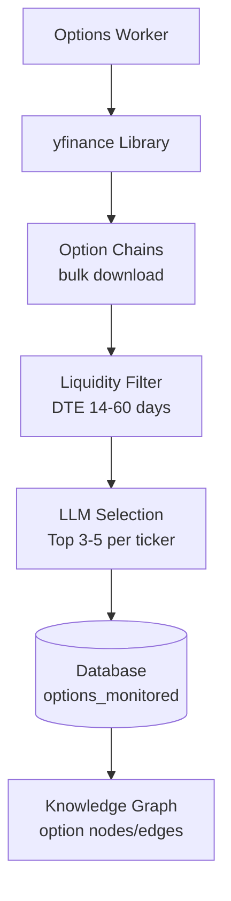
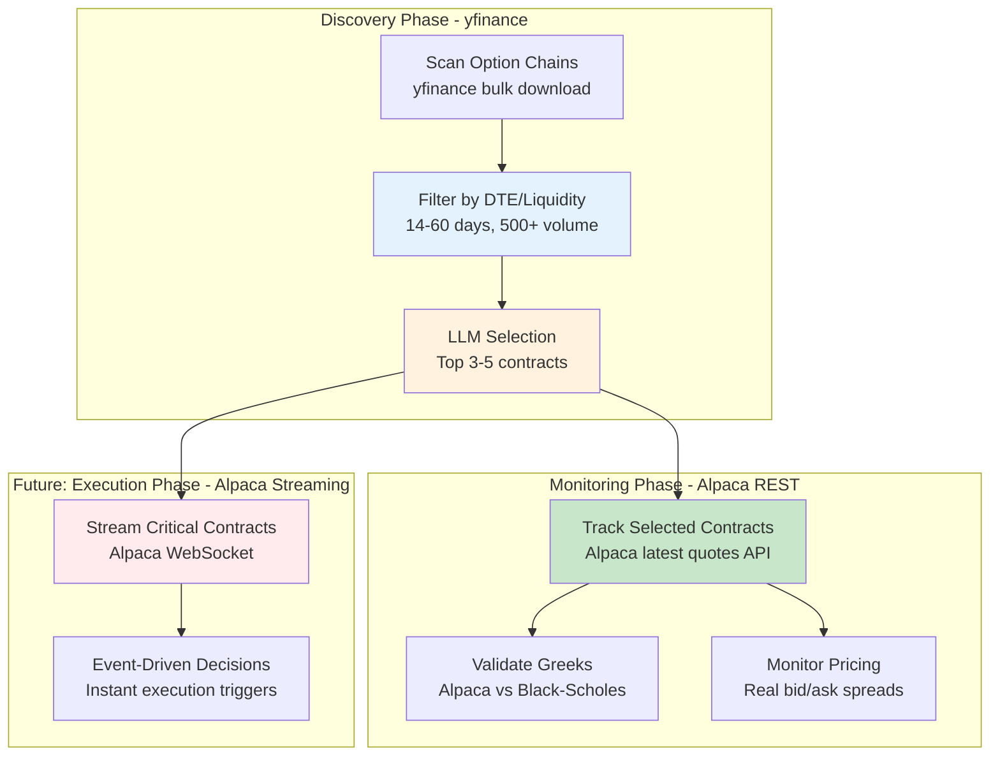
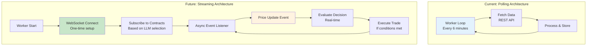

# Alpaca Data Integration Guide

## Overview

This document details the integration of Alpaca market data feeds into KGDreamInvest, comparing capabilities with existing Yahoo Finance integration, and providing guidance on optimal usage patterns.

## Current Status (Jan 3, 2026)

### ✅ Implemented
- **Phase 1**: Data provider routing architecture
- Alpaca historical data client (`src/market/alpaca_client.py`)
- Alpaca trading client (`src/portfolio/alpaca_trading.py`)
- Configuration-based provider selection
- Graceful fallback to Yahoo Finance on errors

### 🔄 In Progress
- **Phase 2**: Alpaca options data exploration and integration planning

### 📋 Planned
- **Phase 3**: Real-time WebSocket streaming integration (optional future enhancement)

---

## Phase 1: Data Provider Routing (COMPLETE)

### Architecture

```python
# Configuration-driven routing in src/market/__init__.py
def last_close_many(symbols, max_workers=10):
    if Config.DATA_PROVIDER == "alpaca":
        try:
            from src.market.alpaca_client import last_close_many_alpaca
            return last_close_many_alpaca(symbols, max_workers)
        except Exception as e:
            logger.error(f"Alpaca failed, falling back to Yahoo: {e}")
            return last_close_many_yahoo(symbols, max_workers)
    else:
        return last_close_many_yahoo(symbols, max_workers)
```

### Usage

```bash
# In .env file

# Use Yahoo Finance (default, free)
DATA_PROVIDER=yahoo

# Use Alpaca (requires API keys)
DATA_PROVIDER=alpaca
ALPACA_API_KEY=your_key
ALPACA_SECRET_KEY=your_secret
```

### Fallback Strategy

The system implements **defense in depth** fallback:
1. Check configuration (`DATA_PROVIDER`)
2. Attempt Alpaca if configured
3. Catch `ImportError` if alpaca-py not installed → fallback to Yahoo
4. Catch API errors (auth, rate limit, network) → fallback to Yahoo
5. Log all fallback events for monitoring

### Benefits

✅ **Zero breaking changes** - Existing code continues working  
✅ **Drop-in replacement** - Same data structure returned  
✅ **Configurable at runtime** - Change providers via .env  
✅ **Fault tolerant** - Never fails completely  
✅ **Easy testing** - Toggle providers to compare results

---

## Phase 2: Alpaca Options Data Exploration

### Current Options Architecture (yfinance-based)



**Current Flow:**
1. Every 6 minutes, select 3-5 random tickers
2. Fetch complete option chains via `yfinance` (all strikes, all expirations)
3. Filter by DTE (14-60 days) and liquidity (500+ volume OR 1000+ OI)
4. LLM selects best 3-5 options with reasoning
5. Store in database, create knowledge graph relationships
6. Calculate Greeks using Black-Scholes if yfinance doesn't provide them

### Alpaca Options Capabilities

Alpaca provides three levels of options data access:

#### 1. **Historical Options Data** (REST API)

```python
from alpaca.data.historical import OptionHistoricalDataClient
from alpaca.data.requests import OptionBarsRequest
from alpaca.data.timeframe import TimeFrame

client = OptionHistoricalDataClient(api_key, secret_key)

# Fetch historical bars for specific option contract
request = OptionBarsRequest(
    symbol_or_symbols="AAPL260117C00180000",  # Contract symbol
    timeframe=TimeFrame.Day,
    start=datetime(2025, 12, 1),
    end=datetime(2026, 1, 3)
)

bars = client.get_option_bars(request)
```

**Returns:**
- Open, High, Low, Close, Volume for each bar
- Historical implied volatility
- Historical Greeks (Delta, Gamma, Theta, Vega, Rho)
- Trade count
- VWAP (volume-weighted average price)

#### 2. **Latest Options Quotes** (REST API)

```python
from alpaca.data.requests import OptionLatestQuoteRequest

request = OptionLatestQuoteRequest(
    symbol_or_symbols=["AAPL260117C00180000", "AAPL260117C00185000"]
)

quotes = client.get_option_latest_quote(request)
```

**Returns:**
```python
{
    "AAPL260117C00180000": {
        "bid_price": 2.45,
        "bid_size": 50,
        "ask_price": 2.55,
        "ask_size": 35,
        "timestamp": "2026-01-03T18:30:00Z"
    }
}
```

**Key Differentiators from yfinance:**
- ✅ Real bid/ask spread (yfinance often shows 0 or stale data)
- ✅ Actual order book depth (bid_size, ask_size)
- ✅ Recent timestamp (can verify data freshness)
- ✅ More reliable during market hours

#### 3. **Real-Time Options Streaming** (WebSocket)

```python
from alpaca.data.live.option import OptionDataStream

stream = OptionDataStream(api_key, secret_key)

@stream.subscribe_quotes("AAPL260117C00180000", "AAPL260117C00185000")
async def on_quote(quote):
    print(f"Live quote: {quote.symbol}")
    print(f"  Bid: ${quote.bid_price} x {quote.bid_size}")
    print(f"  Ask: ${quote.ask_price} x {quote.ask_size}")
    print(f"  Spread: ${quote.ask_price - quote.bid_price:.2f}")
    print(f"  Timestamp: {quote.timestamp}")
    
    # Could trigger instant decisions here
    if quote.ask_price < threshold:
        log_opportunity(quote)

stream.run()
```

**Key Capabilities:**
- ✅ **True real-time** - Updates as market moves (not polling)
- ✅ **Every tick** - Captures all price changes, not just snapshots
- ✅ **Low latency** - <100ms from exchange to your system
- ✅ **Event-driven** - Can trigger instant actions on price movements

### Comparison: yfinance vs Alpaca Options

| Feature | yfinance | Alpaca REST | Alpaca Streaming |
|---------|----------|-------------|------------------|
| **Data Access** | Bulk download | Targeted queries | Push notifications |
| **Option Chain Discovery** | ✅ Complete chains | ❌ Need contract symbols | ❌ Need contract symbols |
| **Historical Data** | ✅ Free, simple | ✅ More attributes | N/A |
| **Bid/Ask Spread** | ⚠️ Often 0 or stale | ✅ Real-time, accurate | ✅ Every update |
| **Greeks** | ⚠️ Sometimes missing | ✅ Always included | ✅ Real-time calc |
| **Update Frequency** | On demand (polling) | On demand (polling) | Real-time (push) |
| **Latency** | Minutes (delayed) | Seconds (recent) | Milliseconds (live) |
| **API Calls** | Low (bulk) | Medium (per contract) | Very low (stream) |
| **Reliability** | ⚠️ Can be flaky | ✅ Production-grade | ✅ Production-grade |
| **Cost** | Free | Free tier | Free tier |
| **Setup Complexity** | Low | Low | High (async) |

### Recommended Hybrid Strategy

Based on the comparison, the optimal approach combines both sources:



### Implementation Plan for Hybrid Approach

#### **Step 1: Option Chain Discovery (Keep yfinance)**

```python
# src/market/options_fetcher.py (current implementation)
def get_options_data(symbols):
    """Use yfinance for comprehensive option chain discovery."""
    for symbol in symbols:
        stock = yf.Ticker(symbol)
        expirations = stock.options  # Get all available dates
        for exp in expirations:
            chains = stock.option_chain(exp)  # Calls and puts together
            # Returns hundreds of contracts in one call
```

**Why keep yfinance for this:**
- ✅ Single API call gets ALL options for a ticker
- ✅ No need to know contract symbols upfront
- ✅ Efficient for broad scanning
- ✅ Current LLM selection logic works well

#### **Step 2: Monitored Options Pricing (Add Alpaca REST)**

Create new function for enhanced pricing of LLM-selected contracts:

```python
# src/market/alpaca_options_client.py (NEW FILE)
from alpaca.data.historical import OptionHistoricalDataClient
from alpaca.data.requests import OptionLatestQuoteRequest, OptionBarsRequest

def get_monitored_options_pricing(contract_symbols):
    """
    Fetch Alpaca pricing for monitored option contracts.
    
    Args:
        contract_symbols: List of option contract symbols from LLM selection
        
    Returns:
        Dict with enhanced pricing data including real bid/ask spreads
    """
    client = OptionHistoricalDataClient(
        Config.ALPACA_API_KEY,
        Config.ALPACA_SECRET_KEY
    )
    
    request = OptionLatestQuoteRequest(symbol_or_symbols=contract_symbols)
    quotes = client.get_option_latest_quote(request)
    
    enhanced_data = {}
    for contract, quote in quotes.items():
        enhanced_data[contract] = {
            "bid": float(quote.bid_price),
            "ask": float(quote.ask_price),
            "bid_size": int(quote.bid_size),
            "ask_size": int(quote.ask_size),
            "spread": float(quote.ask_price - quote.bid_price),
            "spread_pct": float((quote.ask_price - quote.bid_price) / quote.ask_price * 100),
            "timestamp": quote.timestamp.isoformat(),
            "age_seconds": (datetime.now() - quote.timestamp).total_seconds()
        }
    
    return enhanced_data
```

**Usage in Options Worker:**

```python
# src/workers/options_worker.py
def step_once(self):
    # Phase 1: Discovery with yfinance (existing)
    options_df = get_options_data(selected_tickers)
    filtered = filter_options_by_criteria(options_df, spot_prices)
    llm_selected = llm_select_best_options(filtered)
    
    # Phase 2: Enhanced pricing with Alpaca (NEW)
    if Config.DATA_PROVIDER == "alpaca":
        contract_symbols = [opt["contract"] for opt in llm_selected]
        alpaca_pricing = get_monitored_options_pricing(contract_symbols)
        
        # Compare yfinance Greeks vs Alpaca Greeks
        for opt in llm_selected:
            contract = opt["contract"]
            if contract in alpaca_pricing:
                # Detect mispricing
                spread = alpaca_pricing[contract]["spread_pct"]
                if spread > 5.0:  # Wide spread = illiquid
                    opt["liquidity_warning"] = True
                    
                # Use real bid/ask for better pricing
                opt["real_bid"] = alpaca_pricing[contract]["bid"]
                opt["real_ask"] = alpaca_pricing[contract]["ask"]
    
    # Store enhanced data
    store_monitored_options(llm_selected)
```

#### **Step 3: Greeks Comparison & Validation**

Compare calculated Greeks (Black-Scholes) vs Alpaca's Greeks:

```python
def validate_greeks(option_data, alpaca_greeks):
    """
    Compare our Black-Scholes Greeks with Alpaca's Greeks.
    
    Significant divergence may indicate:
    - Mispricing opportunity
    - IV surface peculiarities
    - Early exercise considerations (for Americans)
    """
    our_delta = option_data["delta"]
    alpaca_delta = alpaca_greeks["delta"]
    delta_diff = abs(our_delta - alpaca_delta)
    
    if delta_diff > 0.1:  # 10% difference
        return {
            "alert": "Greeks Divergence",
            "our_delta": our_delta,
            "alpaca_delta": alpaca_delta,
            "difference": delta_diff,
            "implication": "Potential mispricing or model mismatch"
        }
    
    return {"status": "Greeks aligned"}
```

### Alpaca Options Data Attributes (Complete List)

When fetching from Alpaca, you get significantly more data than yfinance:

```python
# Alpaca Option Quote
{
    "symbol": "AAPL260117C00180000",
    "bid_price": 2.45,
    "bid_size": 50,              # ← yfinance doesn't provide
    "bid_exchange": "C",          # ← Exchange code
    "ask_price": 2.55,
    "ask_size": 35,               # ← yfinance doesn't provide
    "ask_exchange": "P",          # ← Exchange code
    "timestamp": "2026-01-03T18:30:25.123Z",  # ← Millisecond precision
    "conditions": ["R"]           # ← Trade conditions
}

# Alpaca Option Bar
{
    "symbol": "AAPL260117C00180000",
    "timestamp": "2026-01-03T00:00:00Z",
    "open": 2.30,
    "high": 2.60,
    "low": 2.25,
    "close": 2.50,
    "volume": 15420,
    "trade_count": 342,           # ← Number of trades
    "vwap": 2.47                  # ← Volume-weighted average price
}

# Alpaca Greeks (if available)
{
    "delta": 0.62,
    "gamma": 0.08,
    "theta": -0.12,
    "vega": 0.35,
    "rho": 0.05,
    "implied_volatility": 0.28    # ← Can compare with your greeks calc
}
```

### Benefits of Alpaca Options Integration

1. **Better Liquidity Analysis**
   - Real bid/ask spread shows true cost of entry
   - Bid/ask sizes reveal order book depth
   - Can avoid illiquid options (wide spreads)

2. **Mispricing Detection**
   - Compare Black-Scholes implied vol with Alpaca's IV
   - Detect discrepancies between our Greeks and exchange Greeks
   - Identify arbitrage opportunities

3. **Improved Decision Quality**
   - Real execution prices (not theoretical mid-points)
   - Fresh data timestamps (verify data isn't stale)
   - Exchange-level attribution (understand where liquidity is)

4. **Future Streaming Capabilities**
   - Foundation for real-time options monitoring
   - Event-driven execution on favorable pricing
   - Instant reaction to IV spikes or crush

### Code Example: Full Integration

```python
# src/market/alpaca_options_client.py (NEW FILE)

import logging
from typing import List, Dict, Optional
from datetime import datetime

from src.config import Config

logger = logging.getLogger("kginvest")


def get_alpaca_options_client():
    """Get Alpaca options historical data client."""
    try:
        from alpaca.data.historical import OptionHistoricalDataClient
    except ImportError:
        raise ImportError("alpaca-py not installed. Run: pip install alpaca-py")
    
    if not Config.ALPACA_API_KEY or not Config.ALPACA_SECRET_KEY:
        raise ValueError("Alpaca API keys not configured")
    
    return OptionHistoricalDataClient(
        Config.ALPACA_API_KEY,
        Config.ALPACA_SECRET_KEY
    )


def get_latest_option_quotes(contract_symbols: List[str]) -> Dict[str, Dict]:
    """
    Fetch latest quotes for option contracts from Alpaca.
    
    Args:
        contract_symbols: List of option contract symbols (e.g., ["AAPL260117C00180000"])
        
    Returns:
        Dict mapping contract symbol to quote data
    """
    try:
        from alpaca.data.requests import OptionLatestQuoteRequest
        
        client = get_alpaca_options_client()
        request = OptionLatestQuoteRequest(symbol_or_symbols=contract_symbols)
        quotes = client.get_option_latest_quote(request)
        
        result = {}
        for symbol, quote in quotes.items():
            result[symbol] = {
                "bid": float(quote.bid_price),
                "ask": float(quote.ask_price),
                "bid_size": int(quote.bid_size),
                "ask_size": int(quote.ask_size),
                "spread": float(quote.ask_price - quote.bid_price),
                "spread_pct": float((quote.ask_price - quote.bid_price) / quote.ask_price * 100) if quote.ask_price > 0 else 0,
                "timestamp": quote.timestamp.isoformat() if quote.timestamp else None,
                "age_seconds": (datetime.now(quote.timestamp.tzinfo) - quote.timestamp).total_seconds() if quote.timestamp else None
            }
        
        return result
        
    except Exception as e:
        logger.error(f"Alpaca options quote fetch failed: {e}")
        return {}


def enhance_monitored_options_with_alpaca(monitored_options: List[Dict]) -> List[Dict]:
    """
    Enhance monitored options data with Alpaca real-time quotes.
    
    Args:
        monitored_options: List of options from database or LLM selection
        
    Returns:
        Same list with added Alpaca pricing data
    """
    if Config.DATA_PROVIDER != "alpaca":
        logger.debug("DATA_PROVIDER not set to alpaca, skipping enhancement")
        return monitored_options
    
    contract_symbols = [opt.get("contract_symbol") or opt.get("contract") for opt in monitored_options]
    contract_symbols = [c for c in contract_symbols if c]  # Filter None
    
    if not contract_symbols:
        return monitored_options
    
    alpaca_quotes = get_latest_option_quotes(contract_symbols)
    
    for opt in monitored_options:
        contract = opt.get("contract_symbol") or opt.get("contract")
        if contract and contract in alpaca_quotes:
            opt["alpaca_bid"] = alpaca_quotes[contract]["bid"]
            opt["alpaca_ask"] = alpaca_quotes[contract]["ask"]
            opt["alpaca_spread"] = alpaca_quotes[contract]["spread"]
            opt["alpaca_spread_pct"] = alpaca_quotes[contract]["spread_pct"]
            opt["data_age_seconds"] = alpaca_quotes[contract]["age_seconds"]
            
            # Flag wide spreads (illiquidity warning)
            if alpaca_quotes[contract]["spread_pct"] > 5.0:
                opt["liquidity_warning"] = "Wide bid/ask spread (>5%)"
            
            # Flag stale data
            if alpaca_quotes[contract]["age_seconds"] and alpaca_quotes[contract]["age_seconds"] > 300:
                opt["data_warning"] = "Data older than 5 minutes"
    
    return monitored_options
```

---

## Phase 3: Real-Time Streaming (Future Enhancement)

### When to Consider Streaming

Streaming makes sense when:
- ✅ You need sub-second latency for decisions
- ✅ You're monitoring <100 specific contracts (focused portfolio)
- ✅ You want to catch instant mispricing opportunities
- ✅ You're comfortable with async/event-driven architecture

Streaming is overkill if:
- ❌ Your decision cycle is >1 minute (polling is fine)
- ❌ You're scanning hundreds of options (too many streams)
- ❌ System complexity is a concern
- ❌ Your strategy is longer-term (not sub-minute moves)

### Architecture Changes Required



### Example Streaming Implementation (Placeholder for Future)

```python
# Future: src/workers/streaming_options_worker.py

import asyncio
from alpaca.data.live.option import OptionDataStream
from src.config import Config

class StreamingOptionsWorker:
    """
    Real-time options monitoring via WebSocket.
    
    NOTE: This is a future enhancement, not currently implemented.
    Requires async event-driven architecture.
    """
    
    def __init__(self):
        self.stream = OptionDataStream(
            Config.ALPACA_API_KEY,
            Config.ALPACA_SECRET_KEY
        )
        self.monitored_contracts = []
    
    async def on_quote(self, quote):
        """Handle real-time quote updates."""
        print(f"Live quote: {quote.symbol}")
        print(f"  Bid: ${quote.bid_price} x {quote.bid_size}")
        print(f"  Ask: ${quote.ask_price} x {quote.ask_size}")
        
        # Check if this is a buying opportunity
        spread_pct = (quote.ask_price - quote.bid_price) / quote.ask_price * 100
        
        if spread_pct < 1.0:  # Tight spread, good liquidity
            if quote.ask_price < self.get_target_price(quote.symbol):
                # Instant decision: favorable price detected
                await self.trigger_buy_signal(quote)
    
    def start(self):
        """Start the streaming worker."""
        # Subscribe to monitored contracts
        self.stream.subscribe_quotes(*self.monitored_contracts)
        self.stream.run()
```

---

## Recommendation Summary

### Immediate Action (Phase 1 - DONE ✅)
- **Data provider routing** implemented
- Market worker can use Alpaca with `DATA_PROVIDER=alpaca`
- Graceful fallback to Yahoo Finance

### Near-Term Enhancement (Phase 2 - RECOMMENDED 🎯)
- **Add Alpaca options pricing** to enhance monitored contracts
- Use **hybrid strategy**:
  - yfinance for discovery (efficient bulk scanning)
  - Alpaca REST for pricing (real bid/ask, better greeks)
- Implement `enhance_monitored_options_with_alpaca()` function
- Add greeks comparison and divergence detection

### Future Exploration (Phase 3 - OPTIONAL ⏭️)
- **Real-time streaming** for critical contracts only
- Event-driven decision making
- Requires architectural changes (async workers)
- Consider only if sub-minute decisions become important

---

## Configuration Guide

### Using Yahoo Finance (Default)
```bash
# .env
DATA_PROVIDER=yahoo
# No additional config needed
```

### Using Alpaca for Equities
```bash
# .env
DATA_PROVIDER=alpaca
ALPACA_API_KEY=PK...
ALPACA_SECRET_KEY=...
ALPACA_PAPER_MODE=true
```

### Using Hybrid (Recommended for Options)
```bash
# .env
DATA_PROVIDER=yahoo  # Keep for option chain discovery
BROKER_PROVIDER=alpaca  # Use for trading
ALPACA_API_KEY=PK...
ALPACA_SECRET_KEY=...

# In code: Call Alpaca for monitored contracts only
# Best of both worlds
```

---

## Next Steps

1. ✅ **Test Phase 1**: Try `DATA_PROVIDER=alpaca` with equity data
2. 🎯 **Implement Phase 2**: Add Alpaca options pricing enhancement
3. 📊 **Monitor & Compare**: Track data quality differences
4. 🔍 **Evaluate Streaming**: Assess if real-time is needed
5. 📝 **Document Learnings**: Update this guide with findings

---

## References

- [Alpaca Data API Docs](https://alpaca.markets/docs/api-references/market-data-api/)
- [Alpaca Options Data](https://alpaca.markets/docs/api-references/market-data-api/options-pricing-data/)
- [alpaca-py GitHub](https://github.com/alpacahq/alpaca-py)
- [alpaca-py Examples - Options](https://github.com/alpacahq/alpaca-py/tree/master/examples/options)
