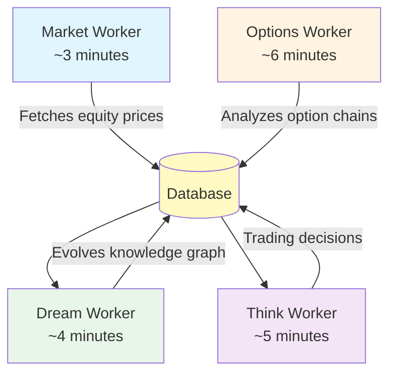
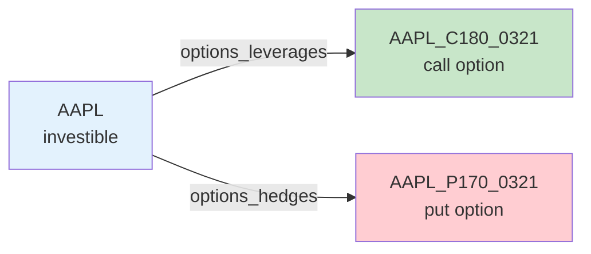

# Options Trading Integration - Design & Implementation

## Overview

KGDreamInvest now includes a sophisticated options trading system with 10% portfolio allocation, LLM-driven option chain selection, and full knowledge graph integration.

## Architecture

### Four-Worker System



## Key Components

### 1. Options Worker (`src/workers/options_worker.py`)

**Responsibilities:**
- Fetches option chains for active investibles
- Filters by DTE range (14-60 days) and liquidity (volume/OI)
- Uses LLM to intelligently select 3-5 best options per ticker
- Updates database with monitored options
- Creates knowledge graph nodes and edges
- Stores pricing snapshots with Greeks

**Flow:**
```python
step_once():
  1. Select 3-5 random investibles (cycling through all over time)
  2. Fetch options data via yfinance
  3. Filter by DTE, volume, open interest
  4. Enrich with calculated Greeks
  5. For each ticker:
     - Prepare options summary for LLM
     - Ask LLM to select best 3-5 options
     - Update monitored_options table
     - Create graph nodes/edges
     - Store snapshots
```

### 2. Greeks Calculation (`src/market/greeks.py`)

Uses Black-Scholes model to calculate:
- **Delta**: Directional exposure (calls: 0-1, puts: -1-0)
- **Gamma**: Rate of delta change
- **Theta**: Time decay per day
- **Vega**: IV sensitivity (per 1% IV change)
- **Rho**: Interest rate sensitivity

```python
calculate_greeks(spot, strike, dte, risk_free_rate, iv, option_type)
# Returns: {delta, gamma, theta, vega, rho}
```

### 3. Options Data Fetcher (`src/market/options_fetcher.py`)

**Functions:**
- `get_options_data(symbols)` - Fetches all option chains from yfinance
- `filter_options_by_criteria()` - Applies DTE, volume, OI filters
- `prepare_options_for_llm()` - Formats data for LLM analysis
- `update_monitored_option()` - Insert/update database
- `store_options_snapshot()` - Save pricing data
- `get_monitored_options_from_db()` - Retrieve current options

### 4. LLM Budget (`src/llm/options_budget.py`)

Separate rate limiter for options LLM calls:
- Independent from main worker budget
- Default: 5 calls/minute
- Sliding window tracking
- Thread-safe

### 5. Database Schema

**New Tables:**

```sql
-- LLM-selected options to monitor
options_monitored (
  option_id, underlying, option_type, strike, expiration,
  contract_symbol, delta, gamma, theta, vega,
  volume, open_interest, implied_volatility,
  selection_reason, enabled
)

-- Pricing snapshots over time
options_snapshots (
  snapshot_id, ts, option_id,
  bid, ask, last, volume, open_interest, iv,
  delta, gamma, theta, vega
)

-- Options positions (for future trading)
options_positions (
  position_id, option_id, qty, avg_cost, last_price
)

-- Options trades history (for future trading)
options_trades (
  trade_id, ts, option_id, side, qty, price, notional, reason
)
```

### 6. Knowledge Graph Integration

**New Node Types:**
- `option_call` - Call options as graph nodes
- `option_put` - Put options as graph nodes

**New Edge Channels:**
- `options_hedges` (0.85) - Put hedges equity downside
- `options_leverages` (0.80) - Call leverages equity upside
- `options_strategy` (0.75) - Part of spread/combo
- `greek_exposure` (0.70) - Delta/Vega correlation

**Graph Structure:**



**Node Naming Convention:**
- Format: `{TICKER}_{C/P}{STRIKE}_{MMDD}`
- Example: `AAPL_C180_0321` = AAPL $180 Call expiring March 21

## LLM Prompt Design

### Options Selection Prompt

**System:** Expert options trader analyzing chains for liquid opportunities

**User Input:**
- Ticker and spot price
- Top 20 options by liquidity (volume + OI)
- Target allocation percentage (10% max)
- Liquidity requirements

**Expected Output:**
```json
{
  "selected_options": [
    {
      "contract": "AAPL241115C00180000",
      "type": "Call",
      "strike": 180.0,
      "expiration": "2024-11-15",
      "reasoning": "Near ATM with delta 0.55, high volume..."
    }
  ],
  "overall_strategy": "Bullish/Bearish/Hedging",
  "risk_assessment": "Low/Medium/High",
  "allocation_recommendation": 7.5
}
```

## Configuration

### Environment Variables

```env
# Options Trading Configuration
OPTIONS_ENABLED=true
OPTIONS_MAX_ALLOCATION_PCT=10.0
OPTIONS_WORKER_SPEED=0.17        # ~6 minutes per cycle
OPTIONS_MIN_VOLUME=500
OPTIONS_MIN_OPEN_INTEREST=1000
OPTIONS_MIN_DTE=14
OPTIONS_MAX_DTE=60
OPTIONS_LLM_CALLS_PER_MIN=5
OPTIONS_MIN_TRADE_NOTIONAL=50.0
OPTIONS_MAX_SINGLE_OPTION_PCT=3.0
```

### Guard Rails

**Portfolio Level:**
- Max 10% total allocation to options
- Max 3% in any single option

**Liquidity Requirements:**
- Minimum 500 daily volume OR 1000 open interest
- Only monitored liquid options selected by LLM

**Time Decay Management:**
- DTE range: 14-60 days (configurable)
- Avoids near-expiration options
- Avoids illiquid long-dated options

## Usage

### Enabling Options Trading

1. **Update .env:**
   ```bash
   OPTIONS_ENABLED=true
   ```

2. **Install dependencies:**
   ```bash
   pip install scipy pandas yfinance
   ```

3. **Run application:**
   ```bash
   python main.py
   ```

### Monitoring Options

The Options Worker will:
- Automatically fetch chains for investibles
- Use LLM to select best options
- Create graph nodes visible in UI
- Store pricing snapshots
- Log all selections with reasoning

### Database Queries

```sql
-- View monitored options
SELECT * FROM options_monitored WHERE enabled=1;

-- View latest option snapshots
SELECT om.*, os.*
FROM options_monitored om
JOIN options_snapshots os ON om.option_id = os.option_id
ORDER BY os.ts DESC
LIMIT 50;

-- View options by underlying
SELECT * FROM options_monitored 
WHERE underlying='AAPL' AND enabled=1;
```

## Future Enhancements

### Phase 2 Features (Not Yet Implemented)

1. **Options Trading Execution**
   - Integrate with Think Worker decisions
   - Add options_agent to multi-agent committee
   - Execute BUY orders for selected options
   - Track P&L for options positions

2. **Advanced Strategies**
   - Bull/Bear call spreads
   - Protective puts for hedging
   - Covered call writing
   - Iron condors

3. **Strategy Evaluator**
   - LLM selects appropriate strategy based on market regime
   - Spread construction logic
   - Multi-leg order support

4. **UI Enhancements**
   - Options panel showing monitored chains
   - Greeks visualization
   - Option nodes in graph (different colors/shapes)
   - Aggregated Greeks exposure

5. **Risk Analytics**
   - Portfolio Greeks (net delta, gamma, theta, vega)
   - Stress testing scenarios
   - Volatility surface analysis
   - Correlation risk

## Technical Details

### Dependencies

- **scipy**: Black-Scholes calculations (norm.cdf, norm.pdf)
- **pandas**: Options data manipulation
- **yfinance**: Option chain fetching
- **numpy**: Numerical operations for Greeks

### Performance Considerations

- **Rate Limiting**: Separate LLM budget (5 calls/min) prevents exhaustion
- **Sampling Strategy**: Analyzes 3-5 tickers per cycle, cycles through all
- **Top-N Filtering**: Shows LLM only top 20 options by liquidity
- **Async Fetching**: Can parallelize yfinance calls for multiple tickers

### Error Handling

- Graceful degradation if yfinance fails (logs error, continues)
- Zero Greeks returned on calculation errors
- LLM failures don't crash worker
- Database errors logged and retried next cycle

## Architecture Decisions

### Why a Separate Worker?

1. **Different cadence** - Options need updates ~6 min vs equities ~3 min
2. **Separate budget** - 10% allocation is independent
3. **Different data model** - Greeks, strikes, expirations
4. **LLM selectivity** - Intelligent filtering vs bulk monitoring
5. **Clean separation** - Can be toggled on/off independently

### Why LLM Selection vs Rule-Based?

1. **Context-aware** - Considers market regime, volatility, trends
2. **Adaptive** - Changes selection based on conditions
3. **Explainable** - Provides reasoning for each selection
4. **Quality over quantity** - Monitors 3-5 best vs 50+ mediocre options
5. **Strategy-aligned** - Selects options that fit overall thesis

### Why Calculate Greeks vs Use yfinance?

1. **Reliability** - yfinance Greeks sometimes missing/incorrect
2. **Consistency** - Black-Scholes standard across all options
3. **Control** - Can adjust risk-free rate, use custom models
4. **Educational** - Shows how Greeks are calculated
5. **Flexibility** - Easy to add exotic Greeks (charm, vanna, etc.)

## File Structure

```
kgdreaminvest/
├── src/
│   ├── market/
│   │   ├── greeks.py               # Black-Scholes Greeks calculation
│   │   └── options_fetcher.py      # yfinance integration
│   ├── workers/
│   │   └── options_worker.py       # Main options worker
│   ├── llm/
│   │   └── options_budget.py       # Separate rate limiter
│   ├── prompts/
│   │   └── options_prompts.json    # LLM selection prompts
│   └── database/
│       └── schema.py               # Options tables (updated)
├── main.py                          # Starts OPTIONS worker
├── requirements.txt                 # Added scipy, pandas, yfinance
└── .env.example                     # Options configuration
```

## Testing

### Manual Testing

1. **Enable options in .env**
2. **Start application**
3. **Wait 6+ minutes** for first cycle
4. **Check logs** for "Options worker" messages
5. **Query database** to see monitored options

### Verification Queries

```sql
-- Count monitored options
SELECT COUNT(*) FROM options_monitored WHERE enabled=1;

-- View latest LLM selections with reasoning
SELECT underlying, option_type, strike, expiration, 
       delta, volume, open_interest, selection_reason
FROM options_monitored 
WHERE enabled=1 
ORDER BY last_updated DESC;

-- Check graph integration
SELECT * FROM nodes WHERE kind IN ('option_call', 'option_put');

SELECT e.*, n1.label, n2.label
FROM edges e
JOIN nodes n1 ON e.node_a = n1.node_id
JOIN nodes n2 ON e.node_b = n2.node_id
WHERE e.top_channel IN ('options_hedges', 'options_leverages');
```

## Summary

The options trading integration provides:

✅ **Clean Architecture** - Dedicated worker following existing patterns
✅ **LLM Intelligence** - Smart option selection, not brute force
✅ **Greeks Calculation** - Black-Scholes implementation
✅ **Knowledge Graph Integration** - Options as first-class graph entities
✅ **Separate Budget** - Independent LLM rate limiting
✅ **Configurable** - Easy to adjust DTE, liquidity, allocation
✅ **Extensible** - Foundation for advanced strategies
✅ **Safe** - Multiple guard rails and liquidity requirements

The system is ready for immediate use and provides a solid foundation for future options trading strategies!
