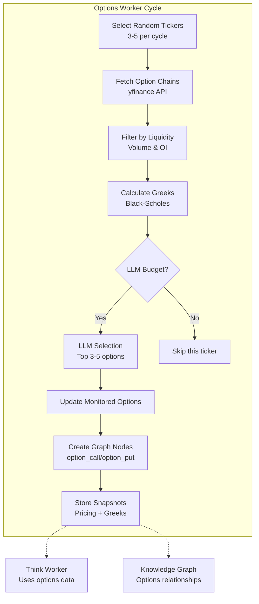
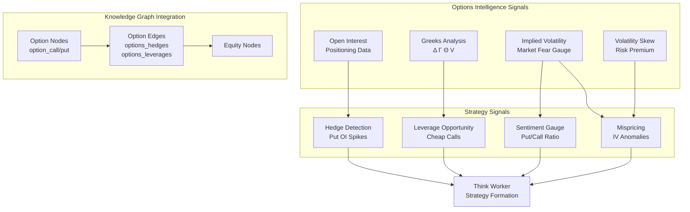
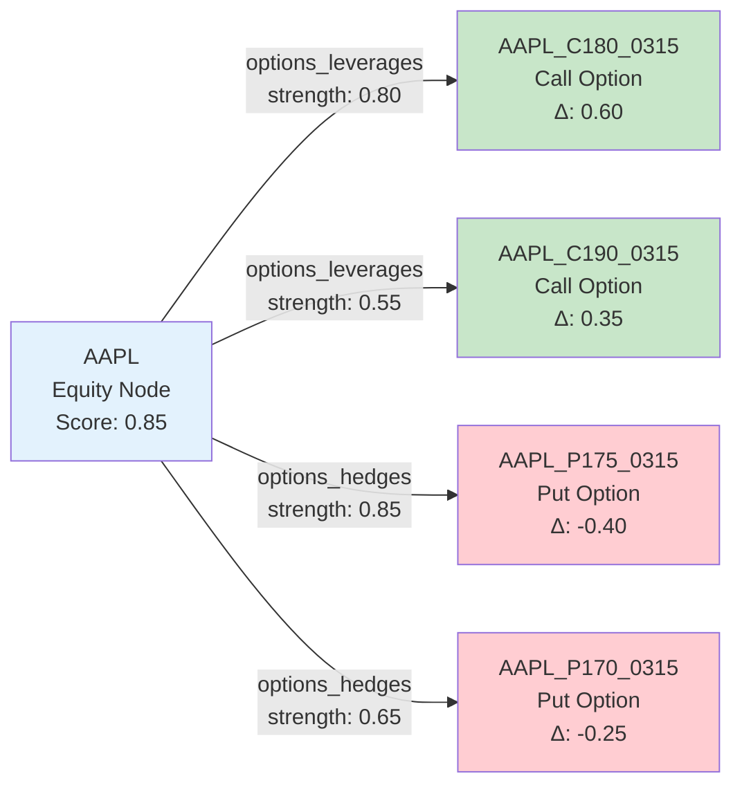
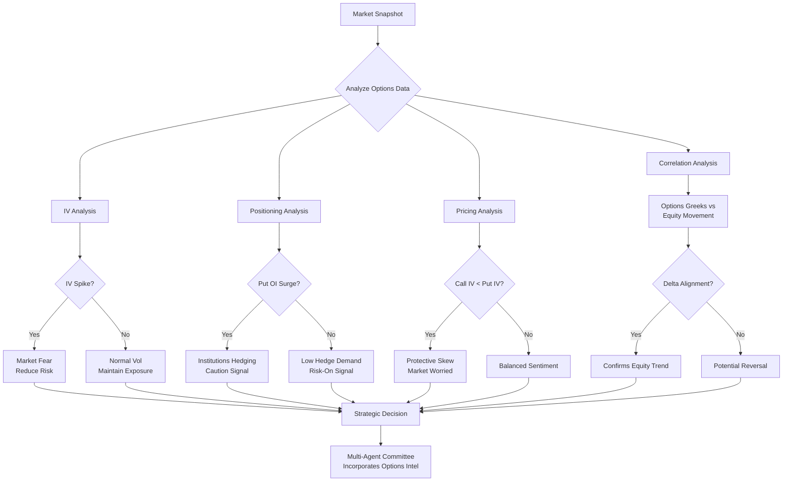
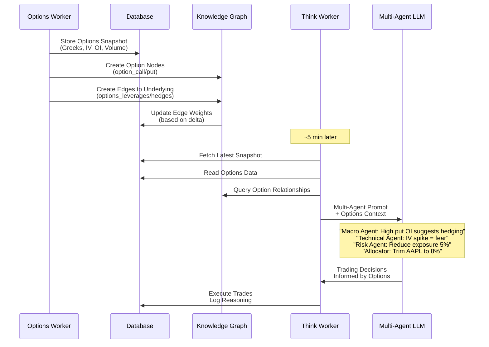

# System Patterns & Architecture

## Core Architecture Pattern: Four-Worker System

### Worker Architecture
The system follows a **Producer-Consumer** pattern with four independent background workers:

```
Market Worker (Producer) → SQLite Database ← Dream Worker (Consumer/Producer)
                                ↓                        ↓
Options Worker (Consumer/Producer) ← Think Worker (Consumer) → Trading Decisions
```

### 1. Market Worker (Data Producer)
- **Frequency**: Every ~3 minutes via `MARKET_INTERVAL`
- **Responsibility**: Fetch live market data, compute indicators, generate signals
- **Pattern**: **ETL Pipeline**
  - **Extract**: Yahoo Finance API calls for all tickers
  - **Transform**: Technical indicators (RSI, momentum, volatility, z-scores)
  - **Load**: Store snapshots in database with mark-to-market updates

### 2. Dream Worker (Knowledge Graph Maintainer)
- **Frequency**: Every ~4 minutes via `DREAM_INTERVAL`
- **Responsibility**: Evolve knowledge graph relationships
- **Pattern**: **Probabilistic Graph Evolution**
  - Random pair selection (investible + bellwether)
  - Correlation analysis on return series
  - LLM-enhanced relationship labeling (30% of the time)
  - Edge weight updates using channel strengths

### 3. Think Worker (Decision Engine)
- **Frequency**: Every ~5 minutes via `THINK_INTERVAL`
- **Responsibility**: Generate trading decisions via multi-agent committee
- **Pattern**: **Committee Decision Making**
  - Read latest market snapshot
  - Multi-agent LLM prompt engineering
  - Critic scoring for insight quality
  - Optional auto-execution with guard rails

### 4. Options Worker (Derivatives Intelligence Layer)
- **Frequency**: Every ~6 minutes via `OPTIONS_INTERVAL`
- **Responsibility**: Monitor and analyze option chains for portfolio intelligence
- **Pattern**: **Selective LLM-Driven Monitoring**
  - Fetch option chains for active investibles
  - Filter by DTE (14-60 days) and liquidity (volume/OI)
  - LLM selects 3-5 best options per ticker
  - Updates monitored options database
  - Creates knowledge graph nodes/edges for options relationships
  - Stores pricing snapshots with Greeks over time



**Why Separate Options Worker?**
- Different cadence (~6 min vs ~3 min for equities)
- Separate 10% allocation budget
- Different data model (Greeks, strikes, expirations)
- LLM selectivity (monitors 3-5 best vs bulk data)
- Independent budget prevents exhaustion

## Database Schema Patterns

### Event Sourcing Elements
- **Snapshots**: Complete market state at each point in time
- **Trades**: Immutable trading history with reasons
- **Dream Log**: Audit trail of all system actions
- **Insights**: Timestamped decision records with evidence

### Graph Storage Pattern
```sql
-- Nodes: Entities in the knowledge graph
nodes (node_id, kind, label, description, score, degree)

-- Edges: Relationships with normalized pairs
edges (edge_id, node_a, node_b, weight, top_channel) 

-- Edge Channels: Multi-channel relationship strengths
edge_channels (edge_id, channel, strength)
```

### Key Pattern: **Normalized Graph Storage**
- Node pairs always stored as `(min, max)` to avoid duplicates
- Edge weights computed from multiple channels
- Degree calculated dynamically for graph metrics

## Knowledge Graph Evolution Pattern

### Channel-Based Relationships
The system uses a **Multi-Channel Edge Model** where each relationship can have multiple aspects:

```python
CHANNEL_WEIGHTS = {
    "correlates": 1.0,
    "drives": 0.9, 
    "hedges": 0.8,
    "liquidity_coupled": 0.7,
    # ... more channels
}
```

### Evolution Algorithm
1. **Heuristic Baseline**: Correlation-based channel assignment
2. **LLM Enhancement**: Probabilistic relationship labeling
3. **Weight Aggregation**: Channel strengths → overall edge weight
4. **Graph Metrics**: Degree and score updates

## Multi-Agent LLM Pattern

### Agent Specialization
The system implements **Role-Based Agent Architecture**:

```python
agents = {
    "macro": {"regime": "risk-on/off", "bullets": [...]},
    "technical": {"top": [...], "bottom": [...], "bullets": [...]},
    "risk": {"cash_buffer_pct": N, "trim": [...], "bullets": [...]},
    "allocator": {"bullets": [...]}
}
```

### Decision Synthesis Pattern
1. **Single LLM Call**: All agents respond in one structured JSON
2. **Structured Output**: Enforced schema for decisions
3. **Fallback Logic**: Rule-based decisions if LLM fails
4. **Critic Scoring**: Quality assessment for insight starring

## Risk Management Patterns

### Guard Rails System
Multiple layers of protection using **Defense in Depth**:

```python
# Portfolio level
MAX_BUY_EQUITY_PCT_PER_CYCLE = 18%
MIN_CASH_BUFFER_PCT = 12%

# Position level  
MAX_SYMBOL_WEIGHT_PCT = 14%
MIN_TRADE_NOTIONAL = $25

# Time-based
TRADE_ANYTIME = False  # Respects market hours
```

### Pattern: **Graduated Constraints**
- **Cycle-level**: Limits per decision cycle
- **Position-level**: Limits per holding
- **Portfolio-level**: Overall exposure limits
- **Time-based**: Trading window restrictions

## Web UI Patterns

### Real-Time Dashboard Pattern
- **Server Push**: WebSocket-like updates via periodic AJAX
- **Component Architecture**: Modular panels (KPIs, graph, controls, insights)
- **Interactive Graph**: vis-network for knowledge graph visualization

### API Design Pattern
```
GET /api/state          # Current system state
GET /graph-data         # Knowledge graph for visualization  
GET /node/<id>          # Node details with connections
GET /edge/<id>          # Edge details with channels
POST /api/worker/action # Worker control endpoints
```

## Error Handling Patterns

### Graceful Degradation
1. **LLM Failures**: Fall back to rule-based decisions
2. **Data Failures**: Continue with cached data
3. **Network Issues**: Retry with exponential backoff
4. **Parse Errors**: Log and continue with defaults

### Budget Control Pattern
```python
class LLMBudget:
    def acquire(self) -> bool:  # Rate limiting
    def stats(self) -> dict:    # Monitoring
```

## Configuration Patterns

### Environment-Driven Configuration
- **Provider Abstraction**: Ollama vs OpenRouter via `LLM_PROVIDER`
- **Speed Controls**: Configurable worker intervals
- **Risk Parameters**: Adjustable guard rail percentages
- **Debug Modes**: Verbose logging and testing hooks

### Pattern: **Strategy Pattern for LLM Providers**
```python
def llm_chat_json(system: str, user: str):
    if LLM_PROVIDER == "openrouter":
        return openrouter_chat_json(system, user)
    else:
        return ollama_chat_json(system, user)
```

## Critical Implementation Paths

### Market Data Flow
```
Yahoo API → fetch_single_ticker() → last_close_many() 
→ compute_indicators() → compute_signals_from_bells() 
→ SQLite snapshots → mark-to-market positions
```

### Decision Flow  
```
Latest snapshot → _llm_committee() → sanitize_decisions()
→ critic_score() → starred insights → execute_paper_trades()
```

### Knowledge Graph Update Flow
```
Random pair selection → corr() analysis → LLM labeling (30%)
→ channel strength updates → edge weight computation → degree updates
```

## Concurrency Patterns

### Thread Safety
- **DB Lock**: `threading.RLock()` for SQLite access
- **Worker Isolation**: Each worker runs independently
- **Cache Protection**: Thread-safe price caching
- **Atomic Operations**: Database transactions for consistency

### Pattern: **Independent Worker Threads**
- No shared state between workers
- Database as single source of truth
- Event-driven communication via database

## Options Integration & Trading Strategy Intelligence

### How Options Enhance Trading Decisions

Options provide a **multi-dimensional intelligence layer** that complements equity positions:



### Options in the Knowledge Graph

Options are **first-class graph entities** with specialized edge types:



**Edge Channels:**
- `options_leverages` (0.80) - Calls provide upside exposure with defined risk
- `options_hedges` (0.85) - Puts protect against downside moves
- `greek_exposure` (0.70) - Correlated delta/vega movements
- `options_strategy` (0.75) - Part of spread or combo strategy

**Node Score Calculation:**
- Option nodes scored by absolute delta (directional conviction)
- Higher open interest → higher score (more market consensus)
- Integrated into overall graph degree calculations

### Trading Strategy Thought Process

The system uses options data to make **context-aware decisions**:



### Detecting Market Conditions via Options

#### 1. **Volatility Regime Detection**

```python
# High IV = Market Fear
if option.iv > historical_avg * 1.5:
    signal = "Risk-Off"  # Think worker reduces exposure
    
# Low IV = Complacency  
if option.iv < historical_avg * 0.7:
    signal = "Risk-On"  # Opportunities for leverage
```

**Graph Impact:** Options with high IV get higher edge weights to underlying → stronger signal in correlation analysis

#### 2. **Institutional Positioning**

```python
# Put OI surge = Hedging activity
put_call_oi_ratio = sum(put.open_interest) / sum(call.open_interest)

if put_call_oi_ratio > 1.5:
    signal = "Institutions Hedging"  # Reduce bullish exposure
elif put_call_oi_ratio < 0.7:
    signal = "Bullish Positioning"  # Market confident
```

**Graph Impact:** High put OI creates stronger `options_hedges` edges → Dream worker identifies defensive correlations

#### 3. **Mispricing Detection**

Options can reveal **disconnect between derivatives and equity**:

```python
# Expected move from options
expected_move = spot_price * iv * sqrt(dte / 365)

# Actual equity volatility
realized_vol = std(returns[-30:])

if iv > realized_vol * 1.3:
    signal = "IV Overpriced"  # Options expensive vs reality
    strategy = "Consider equity over options"
    
if iv < realized_vol * 0.8:
    signal = "IV Cheap"  # Options underpriced
    strategy = "Leverage opportunities via calls/puts"
```

**Graph Impact:** Mispricing creates `greek_exposure` edges with lower correlation → signals opportunity

#### 4. **Sentiment and Momentum**

```python
# Delta-weighted positioning
portfolio_delta = sum(option.delta * option.open_interest)

if portfolio_delta > 0:
    signal = "Net Bullish Options Positioning"
else:
    signal = "Net Bearish Options Positioning"
    
# Compare to equity momentum
if portfolio_delta > 0 and equity_momentum < 0:
    signal = "Divergence - Options Bullish, Stock Weak"
    strategy = "Potential reversal setup"
```

**Graph Impact:** Delta divergence weakens `options_leverages` edges → flags mismatch to Think worker

### Options Data Flow to Trading Decisions



### Correlation Analysis with Options

Options provide **leading indicators** for equity movements:

**Example Correlation Scenarios:**

1. **Hedging Correlation:**
   ```
   Stock declining → Put OI increasing → options_hedges edge strengthens
   Graph signals: "Protective demand rising"
   ```

2. **Leverage Correlation:**
   ```
   Stock rallying → Call OI increasing → options_leverages edge strengthens  
   Graph signals: "Conviction in upside"
   ```

3. **Volatility Correlation:**
   ```
   Stock choppy → IV elevated → greek_exposure edge weakens
   Graph signals: "Uncertainty, reduce position sizes"
   ```

4. **Divergence (Mispricing):**
   ```
   Stock flat → Put IV spiking → Abnormal fear premium
   Graph signals: "Hedges expensive, potential overreaction"
   ```

### Strategic Decision Integration

The Think Worker receives options intelligence via:

1. **Portfolio Greeks Summary:**
   - Net Delta: Overall directional exposure
   - Net Gamma: Sensitivity to moves
   - Net Theta: Time decay drag
   - Net Vega: Volatility exposure

2. **Sentiment Gauges:**
   - Put/Call OI ratio by ticker
   - IV percentile rank (historical context)
   - Volatility skew (risk premium)

3. **Graph Relationships:**
   - Options with strong edges to trending stocks
   - Hedge patterns (multiple stocks showing put activity)
   - Leverage patterns (call accumulation)

4. **LLM receives formatted summary:**
   ```json
   {
     "options_intel": {
       "portfolio_greeks": {"delta": 2.5, "theta": -12.5, "vega": 45.2},
       "by_ticker": {
         "AAPL": {
           "put_call_oi": 1.8,
           "iv_percentile": 85,
           "signal": "High hedging demand, caution"
         }
       }
     }
   }
   ```

### Future Strategy Enhancements

Options data enables sophisticated strategies (not yet implemented):

- **Spread Construction:** Use graph to identify natural hedge pairs
- **Volatility Arbitrage:** Options vs realized vol mispricing
- **Event Detection:** IV spikes before earnings/news
- **Risk Reversal Signals:** Skew changes as sentiment indicators
- **Cross-Asset Hedging:** Options on sector ETFs vs individual stocks

The foundation is built - options are monitored, graphed, and available to the decision engine. Future iterations can leverage this intelligence for explicit options trading.

## Portfolio Reconciliation & Transaction Tracking Pattern

### Complete Audit Trail Architecture

The system implements **Event Sourcing** principles for complete transaction tracking and reconciliation:

```mermaid
flowchart LR
    subgraph "Transaction Storage"
        DB[(SQLite Database)]
        Trades[trades table<br/>Immutable history]
        Positions[positions table<br/>Current state]
        Portfolio[portfolio table<br/>Cash balance]
    end
    
    subgraph "Analysis Layer"
        API[/api/transactions<br/>Backend API]
        Script[reconciliation_report.py<br/>CLI Tool]
    end
    
    subgraph "Presentation Layer"
        Chart[Chart.js Visualization<br/>Performance Timeline]
        Table[Transaction Table<br/>Trade History]
        Cards[Summary Cards<br/>Key Metrics]
    end
    
    Trades --> API
    Trades --> Script
    Positions --> API
    Portfolio --> API
    
    API --> Chart
    API --> Table
    API --> Cards
    
    Script --> Report[Text Report<br/>RECONCILIATION_SUMMARY.md]
```

### Portfolio Value Calculation Pattern

**Pattern:** Reconstruct portfolio value at any point in time by replaying transactions

```python
# Track holdings with average cost basis
holdings = {}  # symbol -> {qty, avg_cost}

for trade in chronological_trades:
    if trade.side == "BUY":
        # Update average cost (weighted average)
        old_qty = holdings[symbol]["qty"]
        old_cost = holdings[symbol]["avg_cost"]
        new_qty = old_qty + qty
        total_cost = (old_qty * old_cost) + notional
        holdings[symbol] = {
            "qty": new_qty,
            "avg_cost": total_cost / new_qty
        }
        running_cash -= notional
        
    elif trade.side == "SELL":
        # Reduce position, maintain avg cost
        holdings[symbol]["qty"] -= qty
        running_cash += notional
    
    # Calculate portfolio value at this point
    equity_value = sum(h["qty"] * h["avg_cost"] for h in holdings.values())
    portfolio_value = running_cash + equity_value
    
    timeline.append({
        "timestamp": trade.ts,
        "portfolio_value": portfolio_value,
        "cash": running_cash,
        "equity": equity_value
    })
```

**Key Insight:** This pattern enables:
- Historical portfolio value reconstruction
- Performance attribution analysis
- Gain/loss calculation (realized vs unrealized)
- Cash flow verification
- Audit trail for compliance

### Realized vs Unrealized Gain Calculation

**Pattern:** Match sales to purchases using FIFO or weighted average cost

```python
def calculate_realized_gain(trades):
    realized_gain = 0
    
    for sale in [t for t in trades if t.side == "SELL"]:
        symbol = sale.symbol
        
        # Find all prior purchases of this symbol
        purchases = [t for t in trades 
                    if t.symbol == symbol 
                    and t.side == "BUY" 
                    and t.trade_id < sale.trade_id]
        
        # Calculate weighted average purchase price
        total_qty = sum(p.qty for p in purchases)
        total_cost = sum(p.notional for p in purchases)
        avg_cost = total_cost / total_qty
        
        # Realized gain = (sale price - avg cost) * qty
        realized_gain += sale.notional - (sale.qty * avg_cost)
    
    return realized_gain
```

**Pattern Benefits:**
- Tax reporting accuracy
- Performance measurement
- Trading strategy evaluation
- Compliance with accounting standards

### API Design Pattern: Timeline Reconstruction

**Endpoint:** `GET /api/transactions`

**Response Structure:**
```json
{
  "trades": [
    {
      "trade_id": 1,
      "ts": "2025-12-30T10:15:00",
      "symbol": "AAPL",
      "side": "BUY",
      "qty": 0.5,
      "price": 200.00,
      "notional": 100.00,
      "cash_after": 400.00,
      "reason": "Multi-agent decision"
    }
  ],
  "timeline": [
    {
      "timestamp": "2025-12-30T10:15:00",
      "portfolio_value": 500.00,
      "cash": 400.00,
      "equity": 100.00,
      "trade": {
        "symbol": "AAPL",
        "side": "BUY",
        "qty": 0.5,
        "price": 200.00,
        "notional": 100.00
      }
    }
  ],
  "summary": {
    "start_balance": 500.00,
    "current_cash": 60.43,
    "current_equity": 459.27,
    "current_total": 519.70,
    "total_invested": 465.20,
    "total_sold": 25.63,
    "realized_gain": 1.13,
    "unrealized_gain": 18.57,
    "total_gain": 19.70,
    "total_return_pct": 3.94,
    "trade_count": 13
  }
}
```

**Pattern:** Single endpoint returns three views of the same data:
1. **Raw Transactions** - Immutable event log
2. **Portfolio Timeline** - Reconstructed state at each event
3. **Summary Statistics** - Aggregate metrics

### UI Visualization Pattern: Chart.js Time-Series

**Pattern:** Multi-dataset chart combining line and scatter plots

```javascript
const chart = new Chart(ctx, {
    type: 'line',
    data: {
        labels: timeline.map(t => new Date(t.timestamp)),
        datasets: [
            {
                label: 'Portfolio Value',
                data: timeline.map(t => t.portfolio_value),
                type: 'line',
                borderColor: '#a78bfa',
                backgroundColor: 'rgba(167, 139, 250, 0.1)',
                fill: true,
                tension: 0.3
            },
            {
                label: 'BUY',
                data: buyTrades.map(t => ({x: t.timestamp, y: t.portfolio_value})),
                type: 'scatter',
                backgroundColor: '#10b981',
                pointRadius: 8
            },
            {
                label: 'SELL',
                data: sellTrades.map(t => ({x: t.timestamp, y: t.portfolio_value})),
                type: 'scatter',
                backgroundColor: '#ef4444',
                pointRadius: 8
            }
        ]
    }
});
```

**Pattern Benefits:**
- Visual performance tracking over time
- Trade execution points clearly marked
- Interactive tooltips with trade details
- Timezone-aware display
- Responsive to window resizing

### Reconciliation Verification Pattern

**Pattern:** Two independent calculations that must match

```python
# Method 1: Sum of all trades
total_invested = sum(t.notional for t in trades if t.side == "BUY")
total_sold = sum(t.notional for t in trades if t.side == "SELL")
calculated_cash = start_cash - total_invested + total_sold

# Method 2: Database current state
actual_cash = db.query("SELECT v FROM portfolio WHERE k='cash'")

# Verification
assert abs(calculated_cash - actual_cash) < 0.01, "Cash reconciliation mismatch!"
```

**Pattern:** Cross-validation ensures data integrity:
- Event sourcing (trades) vs current state (portfolio table)
- Calculated values vs database values
- Timeline reconstruction vs snapshot data

### Summary Card Pattern

**Pattern:** Grid of metric cards with color-coded indicators

```html
<div class="summary-cards">
  <div class="summary-card">
    <div class="summary-label">Total Gain</div>
    <div class="summary-value positive">$19.70</div>
  </div>
  <div class="summary-card">
    <div class="summary-label">Total Return</div>
    <div class="summary-value positive">+3.94%</div>
  </div>
</div>
```

**Styling Pattern:**
```css
.summary-value.positive { color: #10b981; }
.summary-value.negative { color: #ef4444; }
```

**Pattern Benefits:**
- At-a-glance portfolio health
- Clear visual indicators (green/red)
- Responsive grid layout
- Hover effects for interactivity

### Tab Loading Pattern: Lazy Loading

**Pattern:** Load transaction data only when tab is viewed

```javascript
function switchTab(tabName) {
    // ... tab switching logic ...
    
    if (tabName === 'transactions') {
        loadTransactions();  // Fetch data on demand
    }
}

async function loadTransactions() {
    const data = await fetchJSON("/api/transactions");
    renderTransactionsChart(data);
    renderTransactionsTable(data);
    renderTransactionsSummary(data);
}
```

**Pattern Benefits:**
- Reduces initial page load time
- API calls only when needed
- Data freshness ensured on tab view
- Modular component architecture

### Transaction Table Color-Coding Pattern

**Pattern:** Visual differentiation using CSS borders and badges

```css
.transactions-table .trade-buy {
  border-left: 3px solid #10b981;  /* Green for BUY */
}

.transactions-table .trade-sell {
  border-left: 3px solid #ef4444;  /* Red for SELL */
}
```

**Pattern:** Badges for action type:
```html
<span class="pill buy-badge">BUY</span>
<span class="pill sell-badge">SELL</span>
```

**Pattern Benefits:**
- Instant visual recognition
- Consistent color semantics (green=buy, red=sell)
- Enhanced scanability
- Professional appearance

### Data Consistency Pattern

**Pattern:** Database as single source of truth, API as transformation layer

```mermaid
graph TD
    DB[SQLite Database<br/>Single Source of Truth]
    
    DB --> API1[/api/state<br/>Current snapshot]
    DB --> API2[/api/transactions<br/>Historical analysis]
    DB --> Script[reconciliation_report.py<br/>CLI analysis]
    
    API1 --> UI1[Main Dashboard]
    API2 --> UI2[Transactions Tab]
    Script --> Report[Text Report]
    
    style DB fill:#e3f2fd
```

**Key Principles:**
1. **Immutable Events**: Trades table is append-only
2. **Derived State**: Portfolio value calculated from trades
3. **Eventual Consistency**: Positions updated after trades execute
4. **Audit Trail**: Complete transaction history always available

### Use Case: Tax Reporting

The reconciliation pattern enables accurate tax reporting:

```python
def generate_tax_report(year):
    trades = get_trades_for_year(year)
    
    short_term_gains = 0
    long_term_gains = 0
    
    for sale in [t for t in trades if t.side == "SELL"]:
        purchase = find_matched_purchase(sale)
        hold_days = (sale.ts - purchase.ts).days
        gain = sale.notional - (sale.qty * purchase.price)
        
        if hold_days < 365:
            short_term_gains += gain
        else:
            long_term_gains += gain
    
    return {
        "short_term": short_term_gains,
        "long_term": long_term_gains,
        "total_proceeds": sum(s.notional for s in sales),
        "cost_basis": sum(p.notional for p in matched_purchases)
    }
```

This pattern provides the foundation for regulatory compliance and accurate financial reporting.
